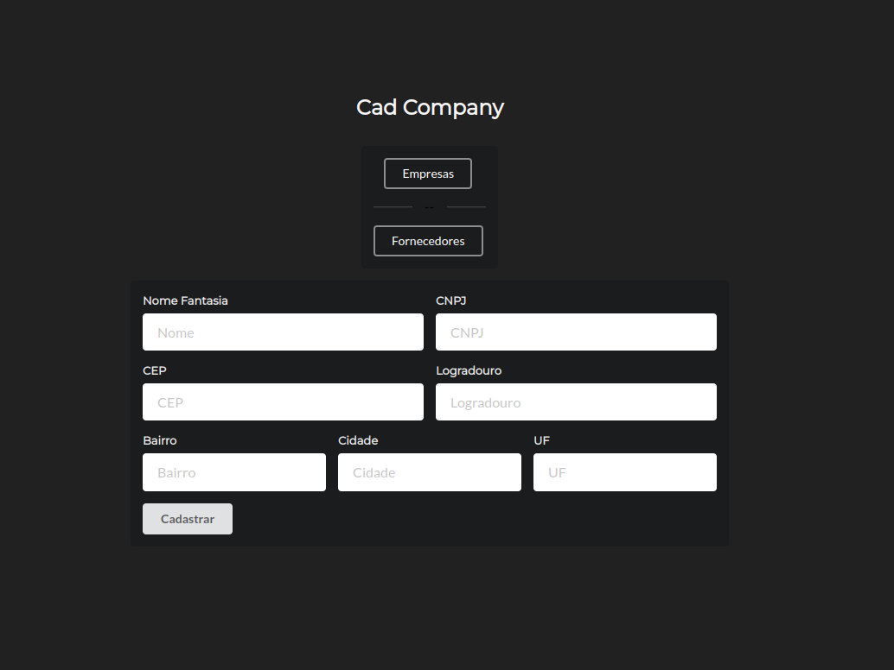

# Cad Company
Projeto de um sistema de cadastro de empresa utilizando seu front-end em React.js.

Com funções Cadastrar Fornecedores e Empresas, além de Listar, Alterar e Excluir ou Inativar um usuário.

## Tecnologias Utilizadas
- React.js;
- Axios;
- InputMask;
- Semantic UI React;

## Instalação
O projeto foi criado através do [Create React App](https://github.com/facebook/create-react-app).

## Para inicializá-lo 

No diretório do projeto, utilizando uma IDE como o Visual Sutio Code escreva o script abaixo em seu terminal:

### `npm start`

No modo desenvolvimento,
Abra [http://localhost:3000](http://localhost:3000) para ser visualizado em seu navegador.

Em paralelo, o projeto back-end também deve ser inicializado utilizando as informações contidas [aqui](https://github.com/ingridmm/desafio).

## Interface do projeto
- Menu de cadastro

- Funcionalidade Cadastro de Empresa

- Funcionalidade Cadastro de Fornecedor

